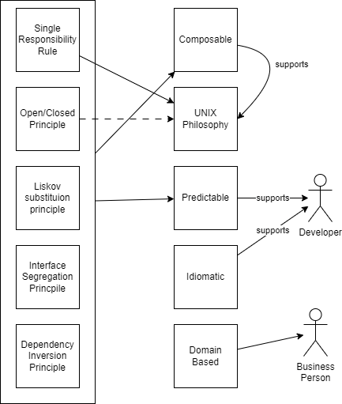

# SOLID - CUPID - GRASP

## Resources

* https://www.boldare.com/blog/solid-cupid-grasp-principles-object-oriented-design/
* https://mozaicworks.com/blog/cupid-vs-solid
* https://www.boldare.com/blog/solid-cupid-grasp-principles-object-oriented-design/

SOLID appears to be more technical (implementation) centred.
It supports testable & maintainable code.
The principles provide a way to objectively reason about the code.

CUPID appears to focus more on the outcome.
It seems these principles seem to be relabling the SOLID principles.

However, CUPID makes it easier for non-technical people to understand what the intent is.
It supports explanations to "business people" why something needs to be done.
In SOLID there is no terms related to "domain language".

Regarding GRASP - at least the first question "who is creating an object" - seems to be a second approach regarding the OO Patterns book (GoF book).

## On "randomness" of principles

If GRASP is considered to be "random" principles, why is this criticism not also valid for SOLID or CUPID?
Presumably: To keep the list short and within the amount of easily remembered items.

## good/bad thinking

We should avoid declaring application or missing the application of principle sets as "bad" or "good".

In total there are a lot of principles, and depending on the project, some will apply, some wont.

## The quest for the ultimate principle

Thought experiment:
With so many principles, would it be possible to create a heat-map and then find the "grand unified principle"?

## Realizations

We realize that this doesn't need to be "one or the other" approach. At least SOLID and CUPID are attempting to achieve the same goal, with different approaches.

GRASP grew out of how to apply UML in general - the book referenced in one of the links (see resources) is a good read.
GRASP brings in several "general" advice. Albeit a random collection.

Considering other principles like "Principle of least astonishment" or "KISS", these are also good principles, yet they are not found in these three sets of principles. Which is why GRASP is considered "random".

Introducing vocabulary is an important side-effect of principles. This allows easy reasoning about them.

Thinking about principles supports you in thinking about your sorftware. Avoid "blind" following them without considering the intent.

The principles are good for different levels of expertise.

"Have you thought about it and made a (conscious) decision?"

## Image

An attempt to map SOLID to CUPID, as well as supporting ideas for people regarding CUPID.

solid-cupid.drawio.png (includes diagrams.net information; raw xml file is solid-cupid.drawio )

